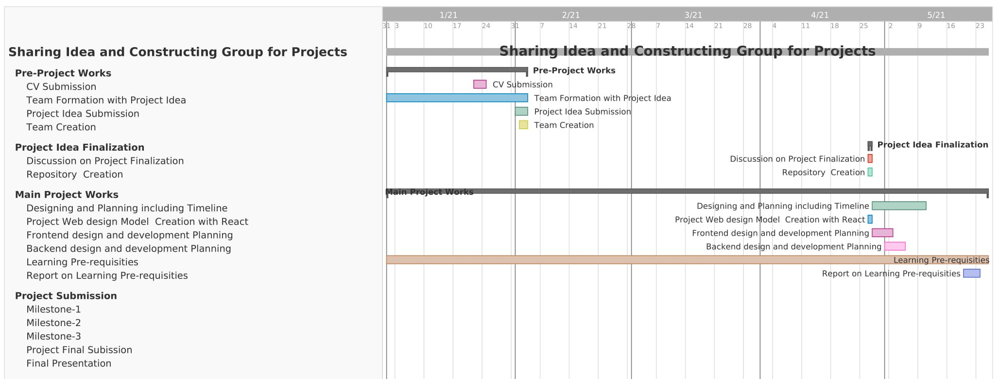

# Idea-Sharing-Platform

## Project Timeline

## Project Milestones

|  SL |               plan of Work Completion                |  Date   | Submission Platform |
| --: | :--------------------------------------------------: | :-----: | :-----------------: |
|   1 |                   Frontend design                    | Done |  GitHub Repository  |
|   2 | Frontend design + 80% Backend | Done |  GitHub Repository  |
|   3 |        Frontend design + 100% Backend        | Running |  GitHub Repository  |

## Report on Learning Pre-requisites

<table>
<tr>
<th>SL</th>
<th>Learning Task </th>
<th>Description</th>
<th>Status </th>
<th>Comment</th>
</tr>
  <tr>
    <td>1</td>
     <td>Web Basics </td>
     <td>Basics of HTML, CSS, Javascript</td>
     <td>
     
     </td>
     <td></td>
  </tr>
  <tr>
    <td>2</td>
     <td>Web Frontend library </td>
     <td>React.js,Bootstrap,Reactstrap,Material-ui</td>
     <td>
     

     
     
     
     
     

     </td>
     <td>Learn some necessary tools and use of Bootstrap,Reactstrap,Material-ui for project.</td>
  </tr>
  <tr>
    <td>3</td>
     <td>Web Backend library </td>
     <td>Node js,GraphQL,MongoDB</td>
     <td>
     

     
     
     
     

     </td>
     <td>Learning more by designing project backend structure.</td>
  </tr>
  <tr>
    <td>4</td>
     <td>Group Chat </td>
     <td>Communicate with group members by sharing text messages,images..</td>
     <td>
     

      
     

     </td>
     <td></td>
  </tr>
 </table>
